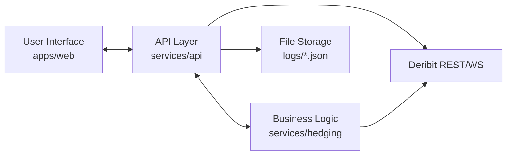

## SECTION 1: EXECUTIVE SUMMARY

### 1.1 Platform Overview
Foxify Collar is a fixed-price protective put system designed for funded traders. It computes drawdown buffers with mark-to-market (MTM) crediting, sources hedging from Deribit, and automates renewals to maintain a protection floor. The platform exposes a Fastify API for pricing, hedging, and audit logging and a React widget for activation and monitoring.

Core value proposition: **fixed fee protection** aligned to funded drawdown floors, automated **hedge execution**, and **operator visibility** via audit logs and risk summaries.

Target users: funded traders and internal operators (exec and ops views), with a UI intended for embedding inside a larger Foxify dashboard.

Recent operational changes (demo readiness):
- Bronze tier supports **put and call protection** with fixed fee unless premium floor is breached.
- Quote caching now applies to **all response types** (including `premium_floor` and capped responses).
- Quote cache TTL extended to **5 minutes** (env-configurable) for demo performance.

### 1.2 Technology Stack
- **Frontend**: React 18 + Vite 5 (`apps/web/package.json`)
- **Backend**: Fastify 4 (`services/api/package.json`)
- **Hedging Engine**: TypeScript + Decimal.js (`services/hedging/`)
- **Connectors**: Deribit REST + WS (`services/connectors/`, `services/api/src/deribitIvLadder.ts`)
- **Database**: ⚠️ NOT IMPLEMENTED — file-based JSON persistence in `logs/` (see Section 4)
- **Blockchain Networks**: ⚠️ NOT IMPLEMENTED — Rust contract is placeholder (`contracts/src/lib.rs`)
- **External APIs/Services**:
  - Deribit REST/WS (`services/connectors/src/deribitConnector.ts`, `services/api/src/deribitIvLadder.ts`)
- **Infrastructure/Hosting**: ⚠️ NOT IMPLEMENTED — no IaC or deployment configs in repo

### 1.3 Key Metrics
- **Supported cryptocurrencies**: BTC only (asset checks in `services/api/src/server.ts`)
- **Supported blockchains**: ⚠️ NOT IMPLEMENTED
- **Maximum coverage limits**: ⚠️ NOT IMPLEMENTED (limits exist for leverage and liquidity, not coverage caps)
- **Response time SLAs**: ⚠️ NOT IMPLEMENTED
- **Uptime targets**: ⚠️ NOT IMPLEMENTED

## SECTION 2: SYSTEM ARCHITECTURE

### 2.1 High-Level Architecture


### 2.2 Component Architecture

#### Frontend Architecture
**Directory overview**
```
apps/web/
├── src/
│   ├── App.tsx                # Main widget UI and workflows
│   ├── components/
│   │   └── AuditDashboard.tsx # Admin monitoring interface
│   ├── adapters/
│   │   └── positionSource.ts  # Demo/Foxify position source adapters
│   ├── config.ts              # Env-driven config
│   └── styles.css             # Global UI styling
└── public/
    └── funded_levels.json     # Tier configuration used by UI
```

**Key components**
- `App.tsx` orchestrates portfolio fetching, quote previewing, protection activation, and audit modal display.
- `AuditDashboard.tsx` renders audit entries and operational metrics (based on `/audit/summary`).

**State management**
- React `useState` + `useEffect` (no external state library).

**Routing**
- No routing; single-screen widget with conditional sections in `App.tsx`.

**API communication**
- Fetch calls against `API_BASE` defined in `apps/web/src/config.ts`.
- Example calls: `/put/quote`, `/risk/summary`, `/audit/summary`, `/audit/logs`.

#### Backend Architecture
**API structure**
Single Fastify server in `services/api/src/server.ts` with 26 endpoints and internal in-memory state for:
- `activeCoverages` (Map)
- `portfolioSnapshots` (Map)
- `hedgeLedger` (Map)

**Service/engine usage**
- Risk calculation from `@foxify/hedging` (`computeRiskSummary`).
- Option selection and rolling hedge logic from `@foxify/hedging` (`buildFixedPriceOption`, `evaluateRollingHedge`).
- Pricing and execution routing via in-process helper functions and a registry (`ExecutionRegistry`).

**Job/worker processes**
Lightweight interval runner inside `server.ts`:
- Periodic `/loop/tick` calls when `LOOP_INTERVAL_MS > 0`
- Periodic `/risk/summary` MTM refresh when `MTM_INTERVAL_MS > 0`

#### Database Architecture
⚠️ **NOT IMPLEMENTED** — file-based JSON persistence:
- `logs/audit.log` (JSONL)
- `logs/coverages.json` (active coverage records)
- `logs/hedge-ledger.json` (hedge positions + realized PnL)

No migrations, no RDBMS schemas, no connection pooling.

### 2.3 Data Flow Diagrams

#### Protection Creation Flow
```
User → POST /put/quote → Option selection + pricing →
POST /deribit/order → Audit log + liquidity update →
POST /audit/export → coverage_activated → coverage persisted
```
**Validation**
- Asset must be BTC (`server.ts` checks)
- Leverage capped by `risk_controls.json`
- Spread/slippage and min-size thresholds applied via `riskControls`
**Error handling**
- Returns `{ status: "no_quote", reason: ... }` for unsupported assets/invalid leverage
- Paper mode returns synthetic order results (see `DeribitConnector.placeOrder`)

#### Hedge Execution Flow
```
POST /loop/tick → GET /risk/summary →
evaluateRollingHedge → decision →
if increase: place order → audit hedge_action + hedge_order
```
**Rollback**
- No transactional rollback; audit log records decisions and outcomes.

#### Payout Processing Flow
⚠️ **NOT IMPLEMENTED** — no payout processing endpoints or contracts.

## SECTION 3: API DOCUMENTATION

### 3.1 API Architecture
- **Base URL**: `http://<host>:4100` (Fastify listens on port 4100)
- **Authentication**: ⚠️ NOT IMPLEMENTED (no auth middleware)
- **Rate limiting**: ⚠️ NOT IMPLEMENTED
- **Versioning**: ⚠️ NOT IMPLEMENTED
- **Error response format**: ad-hoc `{ status: "error", reason: "..." }`

### 3.2 Authentication & Authorization
⚠️ **NOT IMPLEMENTED** — no JWT or session auth in repo.

### 3.3 Endpoint Documentation
All endpoints live in `services/api/src/server.ts`. Authentication: **None** for all endpoints.

#### GET /health
Purpose: Service health check  
Response:
```json
{ "status": "ok" }
```
Implementation: `server.ts` (health handler)

#### POST /portfolio/ingest
Purpose: Store portfolio positions for an account  
Request body:
```json
{
  "accountId": "string",
  "positions": [
    { "asset": "BTC", "side": "long|short", "entryPrice": 0, "size": 0, "leverage": 0 }
  ],
  "source": "string (optional)"
}
```
Validation:
- `accountId` required
- `positions` required
- Asset must be BTC
Response:
```json
{ "status": "ok", "accountId": "demo", "count": 1, "updatedAt": "ISO8601" }
```
Implementation: `portfolioSnapshots` Map + `audit("portfolio_ingest")`

#### GET /portfolio/positions
Purpose: Retrieve stored positions  
Query: `accountId` (default `demo`)  
Response:
```json
{
  "status": "ok",
  "accountId": "demo",
  "positions": [],
  "updatedAt": "ISO8601",
  "count": 0
}
```

#### GET /coverage/active
Purpose: List non-expired coverages  
Query: `accountId` (default `demo`)  
Response:
```json
{ "status": "ok", "accountId": "demo", "coverages": [], "count": 0 }
```
Notes: Expired coverages are pruned and saved to `logs/coverages.json`.

#### GET /coverage/report
Purpose: Match latest coverage per position  
Query: `accountId`  
Response (shape):
```json
{ "status": "ok", "accountId": "demo", "positions": 0, "covered": 0, "coveragePct": "0", "results": [] }
```

#### GET /integration/handshake
Purpose: Integration status  
Response:
```json
{ "status": "ok", "mode": "demo|production", "approved": false, "timestamp": "ISO8601" }
```

#### GET /risk/summary
Purpose: Compute equity + drawdown buffer  
Query:
- `cashUsdc`, `positionPnlUsdc`, `hedgeMtmUsdc`, `drawdownLimitUsdc`, `initialBalanceUsdc`
- `maxMtmAgeMs` (default 15000)
Response:
```json
{
  "equityUsdc": "0.00",
  "drawdownLimitUsdc": "0.00",
  "drawdownBufferUsdc": "0.00",
  "drawdownBufferPct": "0.00"
}
```
Implementation: `computeRiskSummary()` in `services/hedging/src/riskEngine.ts`

#### GET /deribit/instruments
Purpose: List Deribit BTC options  
Response: Deribit API payload from `DeribitConnector.listInstruments`.

#### GET /deribit/ticker
Purpose: Deribit ticker for instrument  
Query: `instrument`  
Response: Deribit API payload from `DeribitConnector.getTicker`.

#### POST /deribit/order
Purpose: Place Deribit order (paper or live)  
Request body includes:
```json
{
  "instrument": "string",
  "amount": 0,
  "side": "buy|sell",
  "type": "market|limit",
  "price": 0,
  "venue": "deribit",
  "coverageId": "string",
  "notionalUsdc": 0,
  "hedgeType": "option|perp",
  "feeUsdc": 0,
  "tierName": "string",
  "premiumUsdc": 0,
  "spotPrice": 0,
  "leverage": 0,
  "feeRecognized": true,
  "subsidyUsdc": 0,
  "reason": "string",
  "accountId": "string",
  "intent": "open|close|hedge",
  "drawdownLimitUsdc": "string",
  "initialBalanceUsdc": "string",
  "assets": ["BTC"],
  "asset": "BTC",
  "positionPnlUsdc": "string",
  "hedgeMtmUsdc": "string",
  "floorPrice": 0
}
```
Validation:
- `intent=close` requires drawdown inputs; blocks if drawdown buffer positive.
Response: Deribit or paper response payload.
Side effects:
- Updates hedge ledger and audit events.

#### GET /deribit/positions
Purpose: Return Deribit positions (BTC)

#### GET /pricing/btc
Purpose: BTC index price

#### GET /pricing/iv/:asset
Purpose: Return implied volatility snapshot  
Response (BTC):
```json
{ "asset": "BTC", "iv": 0.5, "ivHedge": 0.6 }
```

#### POST /pricing/ctc
Purpose: Compute coverage-to-coverage (CTC) fee  
Request body:
```json
{
  "tierName": "string",
  "asset": "BTC",
  "spotPrice": 0,
  "drawdownFloorPct": 0,
  "positionSize": 0,
  "leverage": 0
}
```
Response:
```json
{ "status": "ok", "feeUsdc": "20.00", "reason": "ctc_safety" }
```
Errors:
```json
{ "status": "no_quote", "reason": "unsupported_asset|invalid_leverage|invalid_position|ctc_unavailable" }
```

#### GET /risk/mtm
Purpose: Return MTM components computed from Deribit positions

#### POST /put/preview
Purpose: Async quote preview with cache  
Response:
- Cached quote or `{ "status": "pending" }`

#### POST /put/quote
Purpose: Price fixed-fee protective put  
Request body: `PutQuoteRequest` in `server.ts`  
Validation:
- BTC only
- Leverage limit via `normalizeLeverage`
- Spread/slippage thresholds from `risk_controls.json`
Response: quote payload with premium, strike, buffer target, and scoring.
Behavior notes:
- Bronze tier supports **call and put** protection with fixed fee unless premium floor is breached.
- Responses are cached for **all status types**; cache key uses **fuzzy buckets** (spot rounded to $500, drawdown rounded to 5%, days rounded to whole days) in `buildQuoteCacheKey`.
- Cache hit/miss logging includes a live hit-rate (`[Cache] HIT/MISS - Hit rate ...`).
- Dual-venue pricing uses a **hybrid fast path**: Bybit wins the race when it responds first; Deribit comparison is logged asynchronously via `hybrid_comparison`.

#### POST /put/auto-renew
Purpose: Renew protection near expiry  
Validation:
- Returns `{ status: "too_early" }` if not in renewal window
Response: order result + audit events

#### POST /put/auto-renew/schedule
Purpose: Scheduler helper for renewals  
Request body: `{ enabled, nextExpiryIso, renewWindowMinutes, payload }`

#### GET /risk/daily-summary
Purpose: Return internal risk counters (`riskSummary()`)

#### POST /loop/tick
Purpose: Single-step risk + hedge control loop  
Request body includes account info, hedge settings, and exposure list.

#### POST /audit/export
Purpose: Persist audit payload and activate coverage

#### POST /admin/reset
Purpose: Clear audit logs and reset in-memory state

#### GET /audit/logs
Purpose: Return audit log entries  
Query: `limit`, `showAll`

#### GET /audit/summary
Purpose: Return audit summary for dashboards  
Query: `mode=exec|internal`

#### POST /hedge/roll
Purpose: Rolling hedge decision + execute

##### Requested but Missing Endpoints
⚠️ NOT IMPLEMENTED — endpoints listed in prompt are not present:
- `/api/protection/create`
- `/api/protection/:id`
- `/api/protection/user/:userId`
- `/api/protection/:id/claim`
- `/api/hedge/status`
- `/api/analytics/stats`
 - `/alerts` (referenced in `docs/api.md` but not implemented)

## SECTION 4: DATABASE SCHEMA

### 4.1 Database Technology
⚠️ NOT IMPLEMENTED — file-based JSON persistence only.

### 4.2 Schema Documentation (File-Based)

**Audit Log**  
File: `logs/audit.log` (JSONL)  
Schema (per line):
```json
{
  "ts": "ISO8601",
  "event": "coverage_activated|hedge_order|...",
  "payload": {}
}
```
Source: `services/api/src/server.ts` (`audit()` + `readAuditEntries()`).

**Active Coverages**  
File: `logs/coverages.json`  
Schema: serialized array of `[coverageId, CoverageRecord]`  
`CoverageRecord` in `server.ts`:
```json
{
  "coverageId": "string",
  "expiryIso": "ISO8601",
  "positions": [
    { "id": "string", "asset": "BTC", "side": "long|short", "marginUsd": 0, "leverage": 0, "entryPrice": 0 }
  ]
}
```

**Hedge Ledger**  
File: `logs/hedge-ledger.json`  
Schema:
```json
{
  "ledger": [
    ["INSTRUMENT", { "size": "Decimal", "avgCostUsdc": "Decimal" }]
  ],
  "realizedPnl": "Decimal",
  "timestamp": "ISO8601"
}
```
Source: `saveHedgeLedger()` / `loadHedgeLedger()` in `server.ts`.

### 4.3 Entity Relationship Diagram
⚠️ NOT IMPLEMENTED — no relational database.

## SECTION 5: BLOCKCHAIN INTEGRATION

### 5.1 Supported Networks
⚠️ NOT IMPLEMENTED — no chain integration in codebase.

### 5.2 Smart Contracts
⚠️ NOT IMPLEMENTED — placeholder only:
`contracts/src/lib.rs` defines `CollarSettlement` without logic.

### 5.3 Transaction Management
⚠️ NOT IMPLEMENTED

### 5.4 Wallet Integration
⚠️ NOT IMPLEMENTED

## SECTION 6: PRICING & RISK MODELS

### 6.1 Premium Calculation
The platform prices fixed-fee protection by selecting an options contract whose premium fits under the fixed fee and passes liquidity constraints.

Core logic:
- **Option selection**: `buildFixedPriceOption()` in `services/hedging/src/collarBuilder.ts`
- **Liquidity checks**: `spreadPct()`, `estimateAverageFill()` in `services/hedging/src/pricing.ts`
- **CTC fee**: `POST /pricing/ctc` uses `calculateCtcSafetyFee()` in `server.ts` (internal helper)

Example (actual implementation excerpt):
```typescript
// File: services/hedging/src/collarBuilder.ts
const floorStrike = inputs.side === "put"
  ? inputs.spotPrice.mul(new Decimal(1).minus(inputs.drawdownFloorPct))
  : inputs.spotPrice.mul(new Decimal(1).plus(inputs.drawdownFloorPct));

if (premiumTotal.gt(inputs.fixedPriceUsdc)) continue;
if (spreadPct.gt(maxSpreadPct)) continue;
if (requiredSize.gt(0) && availableSize.lt(requiredSize)) continue;
```

### 6.2 Hedge Strategy
Hedge decisions are based on buffer thresholds and hysteresis:
- Decision logic: `decideHedgeAction()` (`services/hedging/src/hedgeOrchestrator.ts`)
- Rolling evaluation: `evaluateRollingHedge()` (`services/hedging/src/rollingHedge.ts`)

Example:
```typescript
// File: services/hedging/src/hedgeOrchestrator.ts
if (bufferPct.lt(state.bufferTargetPct)) return { action: "increase", reason: "buffer_below_target" };
if (bufferPct.gt(state.bufferTargetPct.plus(state.hysteresisPct))) {
  return { action: "decrease", reason: "buffer_above_target" };
}
```

### 6.3 Risk Management
Risk controls are loaded from `configs/risk_controls.json` and merged with defaults in `services/api/src/riskControls.ts`. Key parameters:
- `max_leverage`
- `max_leverage_by_tier` (per-tier, per-option-type caps)
- `subsidy_daily_cap_usdc`, `subsidy_account_daily_cap_usdc`
- `premium_floor_ratio`
- `ctc_enabled`, `ctc_margin_by_tier`, `ctc_ops_buffer_usdc_by_tier`

Equity formula from `services/hedging/src/riskEngine.ts`:
```typescript
equityUsdc = cashUsdc + positionPnlUsdc + hedgeMtmUsdc;
drawdownBufferUsdc = equityUsdc - drawdownLimitUsdc;
```

## SECTION 7: EXTERNAL INTEGRATIONS

### 7.1 Deribit Integration
Primary execution venue for options/perps.

Implementation:
- `services/connectors/src/deribitConnector.ts`
  - `getTicker()`, `listInstruments()`, `getOrderBook()`, `getIndexPrice()`, `getPositions()`
  - `placeOrder()` supports paper mode and live mode (authenticated).
  - Requests use `fetchWithTimeout` with default 6s timeout (`DERIBIT_TIMEOUT_MS`).

REST endpoints (Deribit):
- `https://test.deribit.com/api/v2` (testnet)
- `https://www.deribit.com/api/v2` (live)

WS usage:
- `services/api/src/deribitIvLadder.ts` subscribes to `ticker.<instrument>.100ms` channels for IV ladder snapshots.

### 7.2 Bybit Integration
Secondary options venue for dual-venue pricing.

Implementation:
- `services/api/src/bybitAdapter.ts`
  - `getBybitOrderbook()`, `getBybitSpotPrice()`, `formatBybitInstrument()`
  - Mainnet requires VPN or allowed region
  - Timeout tuned for performance (5s)

### 7.3 Dual-Venue Pricing (Hybrid)
Pricing engine queries Deribit + Bybit in parallel:
- **Hybrid fast path** returns Bybit immediately if it responds first with valid prices.
- **Background comparison** logs `hybrid_comparison` to audit (captures savings and alerts if Deribit is cheaper).
- Deribit is still queried for competition data, preserving savings analytics.

### 7.4 Price Oracle Integration
⚠️ NOT IMPLEMENTED — price data is pulled from Deribit index endpoints.

### 7.5 Notification Services
Webhook alerts only:
- `sendWebhookAlert()` in `services/hedging/src/alerts.ts`
- Used in `/loop/tick` when `alertWebhookUrl` is provided.

## SECTION 8: SECURITY

### 8.1 Authentication & Authorization
⚠️ NOT IMPLEMENTED — no auth or roles.

### 8.2 API Security
⚠️ NOT IMPLEMENTED — no rate limiting or input sanitization middleware.

### 8.3 Smart Contract Security
⚠️ NOT IMPLEMENTED — no on-chain contracts.

### 8.4 Data Security
Current behavior:
- Secrets loaded from environment variables only (`.env.example`)
- No encryption-at-rest; audit logs are plain JSON files

### 8.5 Private Key Management
⚠️ NOT IMPLEMENTED — no blockchain keys in repo.

## SECTION 9: MONITORING & OBSERVABILITY

### 9.1 Logging
- Audit log: `logs/audit.log` (JSONL)
- Console logs via `console.log` and `app.log.error` in `server.ts`
Recent audit events include `leverage_validation_failed`, `premium_pass_through`, and `put_quote`.

### 9.2 Metrics
⚠️ NOT IMPLEMENTED — no metrics backend or exporters.

### 9.3 Alerting
- Webhook alerts via `ALERT_WEBHOOK_URL` (documented in `docs/ops.md`)

### 9.4 Health Checks
`GET /health` returns `{ status: "ok" }`.

## SECTION 10: DEPLOYMENT & INFRASTRUCTURE

### 10.1 Infrastructure Architecture
⚠️ NOT IMPLEMENTED — no IaC or hosting configs in repo.

### 10.2 Deployment Process
⚠️ NOT IMPLEMENTED — no CI/CD pipelines in repo.

### 10.3 Environment Variables
From `.env.example`:
```bash
PORT=8000
HOST=0.0.0.0
DERIBIT_ENV=testnet
DERIBIT_PAPER=true
DERIBIT_CLIENT_ID=your_client_id_here
DERIBIT_CLIENT_SECRET=your_client_secret_here
QUOTE_CACHE_TTL_MS=300000
QUOTE_CACHE_STALE_MS=20000
QUOTE_CACHE_HARD_MS=120000
AUDIT_LOG_PATH=./logs/audit.log
RISK_CONTROLS_PATH=./configs/risk_controls.json
```
Additional runtime env used in code:
- `LOOP_INTERVAL_MS`, `MTM_INTERVAL_MS`, `APP_MODE`, `FOXIFY_APPROVED`, `ACCOUNTS_CONFIG_PATH`

### 10.4 Scaling Strategy
⚠️ NOT IMPLEMENTED — single-instance, file-based state.

### 10.5 Disaster Recovery
⚠️ NOT IMPLEMENTED — no backup or DR tooling.

## SECTION 11: TESTING

### 11.1 Testing Strategy
Current tests focus on hedging engine unit tests (Vitest).

### 11.2 Unit Tests
Location: `services/hedging/tests/`
Example:
```typescript
// File: services/hedging/tests/riskEngine.test.ts
const summary = computeRiskSummary(
  { cashUsdc: new Decimal("10000"), positionPnlUsdc: new Decimal("-500"),
    hedgeMtmUsdc: new Decimal("200"), drawdownLimitUsdc: new Decimal("9000") },
  new Decimal("10000")
);
```

Run tests:
```bash
npm run test
```

### 11.3 Integration Tests
⚠️ NOT IMPLEMENTED

### 11.4 E2E Tests
⚠️ NOT IMPLEMENTED

### 11.5 Load Testing
⚠️ NOT IMPLEMENTED

## SECTION 12: OPERATIONS RUNBOOK

### 12.1 Common Operations
- Start API: `npm run dev:api`
- Start web: `npm run dev:web`
- Run a single control loop: `POST /loop/tick`

### 12.2 Incident Response
⚠️ NOT IMPLEMENTED — no formal runbook in repo beyond `docs/ops.md`.

### 12.3 Maintenance Windows
⚠️ NOT IMPLEMENTED

## SECTION 13: DEVELOPMENT GUIDE

### 13.1 Development Environment Setup
From `README.md`:
1. Copy `.env.example` to `.env` and fill in Deribit keys.
2. Start API and web:
   - `npm run dev:api`
   - `npm run dev:web`

### 13.2 Project Structure
```
apps/web/            # React UI
services/api/        # Fastify API server
services/hedging/    # Risk + hedging engine (Decimal.js)
services/connectors/ # Deribit connector
packages/shared/     # Shared types and Zod schemas
configs/             # Risk controls + funded levels
docs/                # Architecture and operational docs
contracts/           # Placeholder Rust contract
```

### 13.3 Coding Standards
Not explicitly documented. Code uses:
- TypeScript with ES modules
- Decimal.js for financial math (hedging engine)

### 13.4 Adding a New Feature
Example: add new asset support (ETH)
- Update asset validation in `services/api/src/server.ts`
- Update Deribit queries to include ETH instruments
- Extend funded levels if needed
- Update UI to allow ETH selections
⚠️ NOT IMPLEMENTED — ETH support is not in code today.

## SECTION 14: COMPLIANCE & LEGAL
⚠️ NOT IMPLEMENTED — no compliance or legal docs in repo.

## SECTION 15: ROADMAP & FUTURE ENHANCEMENTS
⚠️ NOT IMPLEMENTED — no roadmap in repo.

## SECTION 16: APPENDICES

### 16.1 Glossary
- **Coverage**: A protection policy represented by `coverageId` and `expiryIso`
- **Drawdown Buffer**: `equityUsdc - drawdownLimitUsdc`
- **Hedge Ledger**: Persisted net hedge positions in `logs/hedge-ledger.json`

### 16.2 Error Codes Reference (Observed)
Actual response reasons from API:
- `invalid_payload`
- `unsupported_asset`
- `invalid_leverage`
- `no_quote`
- `too_early`
- `blocked` (close intent)
- `missing_drawdown_inputs`
- `drawdown_buffer_positive`

### 16.3 API Rate Limits
⚠️ NOT IMPLEMENTED — no rate limiting.

### 16.4 Supported Assets
| Asset | Symbol | Supported | Notes |
|------|--------|-----------|-------|
| Bitcoin | BTC | Yes | Only asset accepted by API |

### 16.5 Contact Information
⚠️ NOT IMPLEMENTED — no contact info in repo.

---

## Summary
Total sections completed: 16/16  
Sections with missing info: Database (RDBMS), blockchain integration, auth, monitoring, deployment, compliance, roadmap, detailed infra.  
Recommended next steps:
- Implement auth, rate limiting, and persistent database.
- Add infra/CI/CD configs.
- Define SLAs and operational runbooks beyond the current docs.
